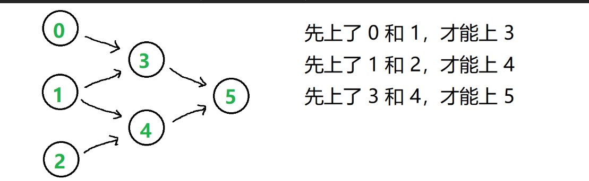
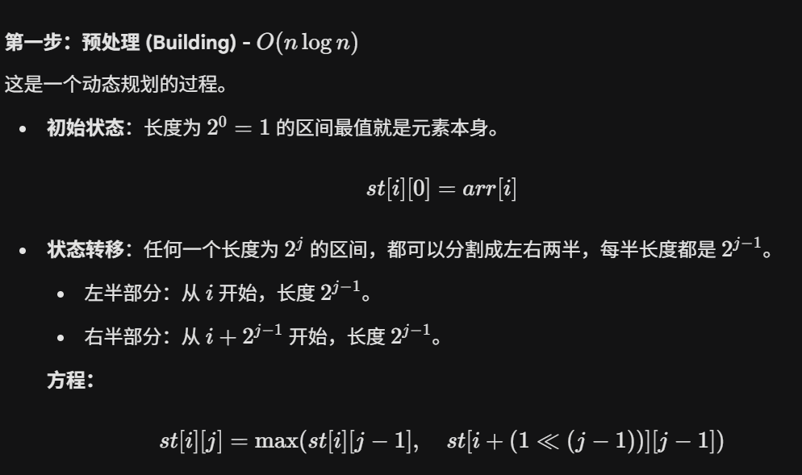
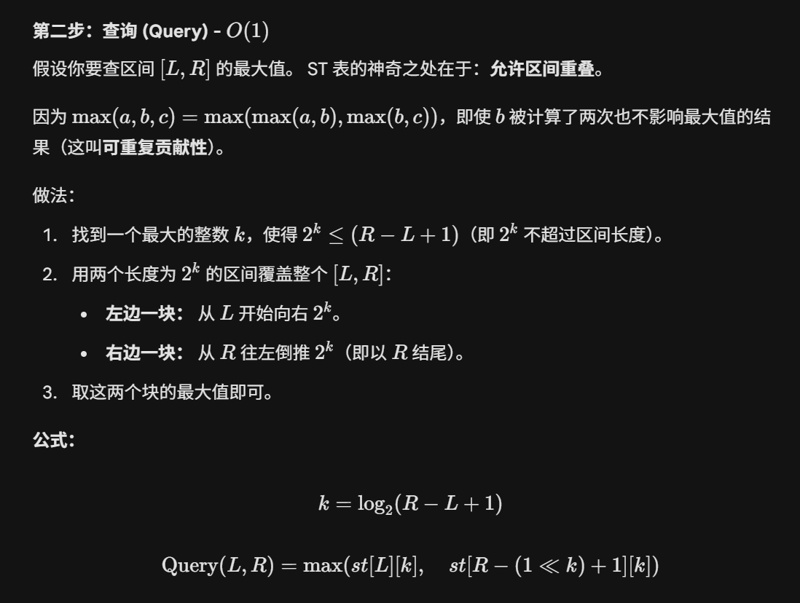
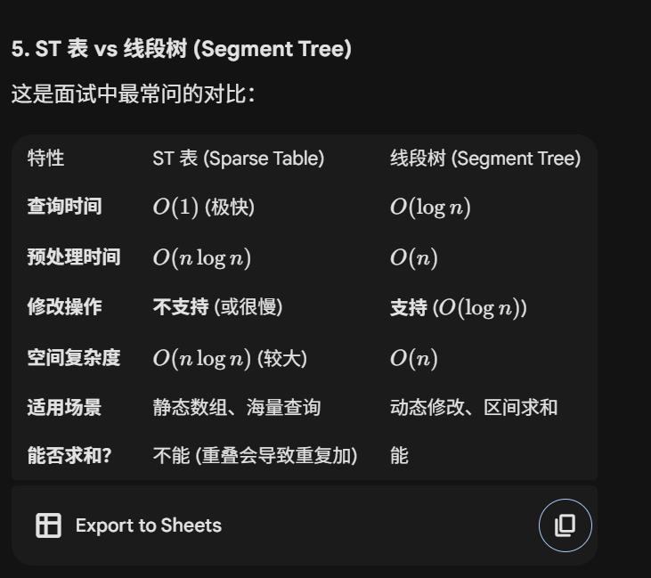
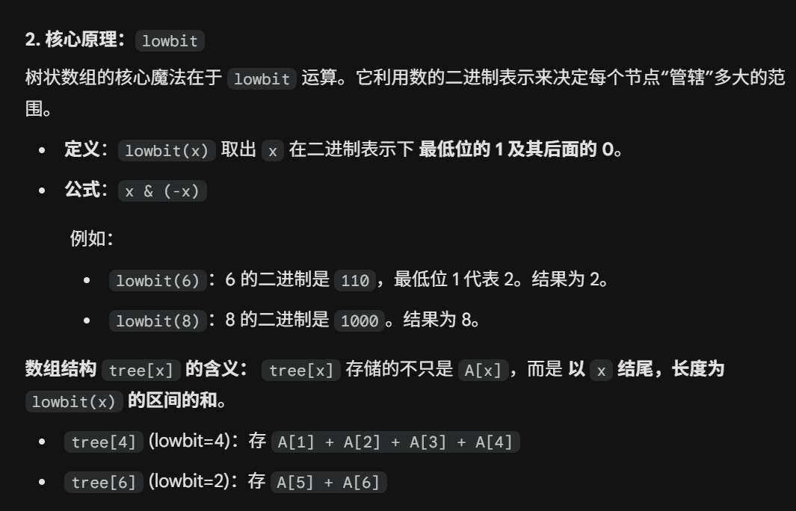
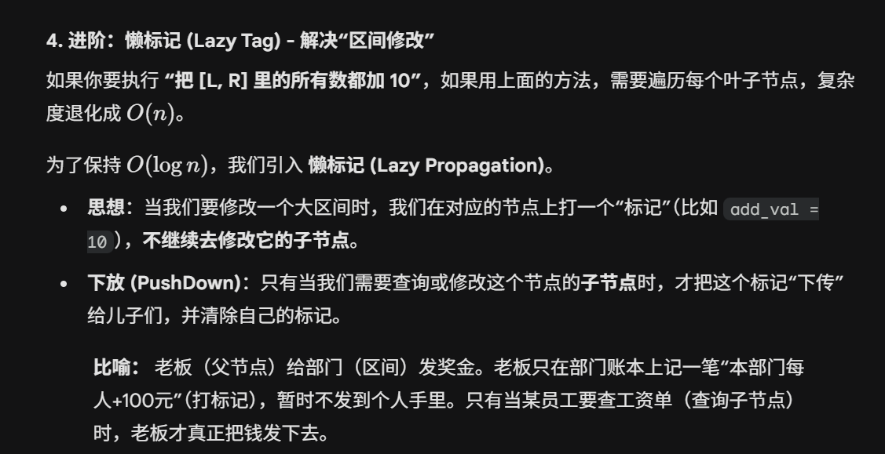

<div align="center">
  <h1>刷题技巧总结</h1>
</div>

<p align="center">
  <a href="https://opensource.org/licenses/MIT"></a>
</p>

> 本仓库用于记录在刷题过程中总结的一些技巧和经验，方便日后复习和参考。
----

# 技巧列表

## 时间先后(先进先出)问题
- **队列(queue)** 是一种先进先出(FIFO)的数据结构，适用于需要按顺序处理元素的场景。**时间滑动窗口**的问题,这里的固定大小,通过`手动计数`维护
- **权重自动排序** 将时间先后顺序转化为权重排序：能实现自动排序的有
  - `priority_queue(堆)` :中间插入和删除时间复杂度为`O(log n)`,理论上和`set`,`map`类似,但实际运行时间会更快一些,因为底层实现更简单,没有`红黑树`那么复杂的旋转操作。但是不支持`按值查找(存不存在)、修改和删除`操作,只能删除堆顶元素,即不能访问和操作中间元素。
  - `set`：支持自动排序和按值查找、删除操作,时间复杂度为`O(log n)`,底层实现为`红黑树`，而且自带`去重`功能。可以操作中间元素,而且存储时所有元素严格有序
  - `map`: 支持键值对存储，按键自动排序，时间复杂度为`O(log n)`，底层实现为`红黑树`。适用于需要按键排序且需要存储额外信息的场景。可以操作中间元素,而且存储时所有元素严格有序


## 动态修改后频繁查询
- `单点动态修改` 注意：在第一次查询完后，如果动态单点修改，其实后面很大一部的元素第二次去查询时是没有变化的，只有与被修改点相关的元素才会发生变化，所以可以在每个节点添加`统计标记(缓存)`，避免重复计算,但单点修改时，需要更新与该节点相关的所有节点的缓存标记。这样可以避免每次查询时不必要的重复计算，提高查询效率。


## 中间节点 
### 对半分下标问题(思考的时候直接使用 2n 或 2n-1 作为下标带进去算比一下较好理解)
- 当对半分`0~n`下标的问题时，如果为`奇数`,则`i<=(n-1)/2`是不包含中间节点,即后半部分比前半部分多一个节点的;`i<=n/2`则包含中间节点,前面比后面多一个中间节点。
### `快慢指针`可以实现 n 等分问题
- `快慢指针`用于寻找链表的中间节点时,当为`奇`数时,`慢指针`最终指向中间节点;
    ```c++
        if(head==nullptr) return nullptr;
        ListNode* slow = head;
        ListNode* fast = head;
        while (fast->next != nullptr && fast->next->next != nullptr) {
            slow = slow->next;
            fast = fast->next->next;
        }
        // 当链表长度为奇数时，slow 指向中间节点
        
        // 可以直接通过 if(fast->next != nullptr) 判断链表长度为偶数还是奇数
        if(fast->next != nullptr){
            // 链表长度为偶数
        } else {
            // 链表长度为奇数，slow 指向中间节点
        }
    ```
    **思路**：`0`号节点废了，后面走的时候，每次走的时候`fast`指针指向的下标都是`slow`指针的`两倍`,所以当最后一个节点下标是`2n`时,则`slow`指针指向`n`号节点,即中间节点.

## 链表
- **痛点**：
  - 无法高效获取长度，无法根据偏移快速访问元素
  - 处理链表时，常常需要使用`哨兵节点(虚拟头节点)`来简化边界条件的处理。
- **双(快慢)指针** 经常用来解决链表中的无法随机访问的问题。
  - **中间**节点 
  - **环形**链表: 
    - **快慢指针**：如果有环，只要一直跑，`快指针`一定会追上`慢指针`,即两指针会相遇,但**不保证**相遇的点是环的入口点,可以使用数学等式推到出位置,看`leetcode 142`题。
       
       - 除了官方数学推理，还可以在相遇时，让一个指针继续走一圈，计算出环的长度 `C`。然后重头开始,让一个指针多走 `C` 步，再让两个指针同时走，最终会在环的入口点相遇。
       
       - 环前面的长度可以直接按照官方解，在相遇后，让一个指针回到头节点，然后两个指针同时走，计算步数，最终会在环的入口点相遇。
    - **标记**：如果节点中数据有范围，可以使用将**走过**(一般使用在原处`标记`或者使用`容器(unorder set等)记录并查找判断`下来)的节点数据标记为一个特殊值(如`INT_MAX`),如果再次遇到该值,则说明有环。即走过的路径`做标记`或者`染色`。
  - **倒数第K**个节点


## 选择 `unorder_map`、`map` 还是`vector(数组)`进行存储
- `map`:
  - 适用于`键值对`中`键`为`非整数`类型的情况，如字符串、浮点数等。
  - 键为`整数`时,但`分布稀疏,范围较大`时也适用。
  - 实现基于`红黑树`，查询、插入、删除的时间复杂度为`O(log n)`。
- `unorder_map`:
    - 适用于`键`为`整数`类型，且`范围较大但`分布较密集`的情况。
    - 实现基于`哈希表`，查询、插入、删除的时间复杂度为`O(1)`的平均时间复杂度，但在最坏情况下可能退化为`O(n)`。
- `vector(数组)`:
  - 适用于`键`为`整数`类型,且`范围较小且分布较密集`的情况。可以实现`O(1)`的查询(通过索引直接访问)。

## 组合问题(选择一些元素问题)
### 从 `n` 个元素中选择任意个元素的组合
- **不可重复**选择:
  - `2`进制模拟，即从 `0` 到 `2^n - 1` 遍历，每个数的二进制表示对应一个组合，`1` 表示选择该元素，`0` 表示不选择该元素。
    ```cpp
    vector<vector<int>> subsets(vector<int>& nums) {
        int n = nums.size();
        vector<vector<int>> result;
        for (int i = 0; i < (1 << n); ++i) { // 遍历从 0 到 2^n - 1
            vector<int> subset;
            for (int j = 0; j < n; ++j) {
                if (i & (1 << j)) { // 检查第 j 位是否为 1
                    subset.push_back(nums[j]);
                }
            }
            result.push_back(subset);
        }
        return result;
    }
    ```
   - `递归回溯`: 递归可以在当前的选择中再多生出`n`中不同选择路径。递归中根据`是否`选择`当前元素`来实现分支，**注意** 在选择了的分支递归完之后的`回溯`阶段记得`撤销选择`,以便进行下一次选择。<br>
   从左到右按照循序判断每个元素`选/不选`,实现二叉树的分支。
    ```cpp
    // 或者 这种没有剪枝
    void backtrack(vector<int>& nums, int index, vector<int>& current, vector<vector<int>>& result) {
        if (index == nums.size()) {
            result.push_back(current); // 将当前组合加入结果
            return;
        }
        // 不选择当前元素
        backtrack(nums, index + 1, current, result);
        
        // 选择当前元素
        current.push_back(nums[index]);
        backtrack(nums, index + 1, current, result);
        current.pop_back(); // 撤销选择，回溯
    }

    // 或者 这种有剪枝  index 表示起始下标
    void backtrack(vector<int>& nums, int start, vector<int>& current, vector<vector<int>>& result) {
        if (start > nums.size()){
            result.push_back(current); // 将当前组合加入结果
            return;
        }
        result.push_back(current); // 将当前组合加入结果
        for (int i = start; i < nums.size()+1; ++i) {
            current.push_back(nums[i]); // 选择当前元素
            backtrack(nums, i + 1, current, result); // 递归选择下一个元素
            current.pop_back(); // 撤销选择，回溯
        }
    }
    ```
- **可重复选择**:
    - `递归回溯`: 递归中根据`是否`选择`当前元素`来实现分支,注意在选择了的分支递归时,下一个递归传入的`起始下标`不变,以便实现`重复选择`当前元素。<br>
    这里和上面的`不可重复选择`的区别就在于`递归调用时传入的下标不同`,一个是`i+1`(**不可重复**),一个是`i`(**可重复**，下次还可以从`i`开始选择)。
    ```cpp
    void backtrack(vector<int>& nums, int start, vector<int>& current, vector<vector<int>>& result) {
        result.push_back(current); // 将当前组合加入结果
        for (int i = start; i < nums.size(); ++i) {
            current.push_back(nums[i]); // 选择当前元素
            backtrack(nums, i, current, result); // 递归选择下一个元素，注意这里传入的是 i 而不是 i + 1
            current.pop_back(); // 撤销选择，回溯
        }
    }
    ```
    
## 配对问题
- 使用`栈`：栈可以实现`配对`问题,如括号匹配问题,遇到左括号入栈,遇到右括号出栈,最后栈为空则表示配对成功。
  ```cpp
  bool isValid(string s) {
      stack<char> st;
      for (char c : s) {
          if (c == '(' || c == '{' || c == '[') {
              st.push(c);
          } else {
              if (st.empty()) return false;
              char top = st.top();
              st.pop();
              if ((c == ')' && top != '(') ||
                  (c == '}' && top != '{') ||
                  (c == ']' && top != '[')) {
                  return false;
              }
          }
      }
      return st.empty();
  }
  ```


## 反序问题：反转字符串/数组的方法
- 使用`双指针`法:
  ```cpp
  void reverseString(vector<char>& s) {
      int left = 0, right = s.size() - 1;
      while (left < right) {
          swap(s[left], s[right]);
          left++;
          right--;
      }
  }
  ```
- 使用`标准库`函数:
  ```cpp
  #include <algorithm>
  void reverseString(vector<char>& s) {
      reverse(s.begin(), s.end());
  }
  ```
- 使用`栈`: 栈可以实现`反序`问题,使用`递归`函数也可以,因为递归本质上也是利用了`系统栈`的特性。
  ```cpp
  #include <stack>
  void reverseString(vector<char>& s) {
      stack<char> st;
      for (char c : s) {
          st.push(c);
      }
      for (int i = 0; i < s.size(); i++) {
          s[i] = st.top();
          st.pop();
      }
  }
  ```
## 对于 `字母异位词` 的处理优化方法
**字母异位词**：
> 是指两个有序组合中所有元素相同，但排列顺序不同的组合。比如 "listen" 和 "silent" 就是字母异位词。

**优化技巧**：
- 让这些组合以某个`规则`(如字母升序、降序)进行`排序`，即可以将`字母异位词` 归类到一起，方便后续处理。
  - 这里的`排序`可以优化：
    - 通常使用`快速排序sort()`，时间复杂度为 O(n log n)。
    - 但对于`元素多而值域少，即相同元素重复较多`的情况，可以使用`计数排序`(`桶排`)，时间复杂度可优化至 O(n)。
- `简单但低效`的方法：直接使用`multiset`进行存储和比较
- `hash+链式(vector)`方法：直接使用`各元素值累加`(或者其他去除`位置因素`的计算方法)作为索引,初步缩小搜索范围,优化搜索效率，然后再逐一元素比较。
   - **优点**：
      - 不用考虑位置因素
      - 不用多次比较，只需要计算一次 hash 值，比较一次 hash 数值即可。
   - **注意**：不能直接使用 `hash `值进行比较，因为不同的组合(如`af`和`be`)可能会产生相同的 hash 值（哈希冲突），只能缩小范围，不能直接作为唯一标识。
- **桶排计数**：
  - 对于值域较小(如`字母串`)，可以使用桶排计数`每个字母出现的次数`作为唯一标识;
  - 如果值域范围大，可以使用`哈希函数`对计数结果进行压缩，得到一个较小的唯一标识，利用`unorder_map`进行存储和比较,因为`unorder_map`底层实现就是`hash`，可以实现`O(1)`的平均时间复杂度。

## 枚举所有选择`两个`边界的方法即 $C_n^{2}$
- **双循环枚举(定一(后边界)法)** 内循环从开始到达外循环当前位置，即可枚举所有`两个`边界组合且不重复。可以理解为将`两个动变边界`转化为`定住一个结尾边界,枚举另一个起始边界`的问题。
```cpp
for (int i = 0; i < n; ++i) {
    for (int j = 0; j < i; ++j) {// 当 以 i 作为结尾边界时，枚举所有起始边界 j
        // 处理边界 (j, i)
    }
}
```

- **双指针枚举(夹逼法)** 双指针分别指向`两个边界`,根据某种条件移动`左/右`指针,实现剪枝优化。
```cpp
int left = 0, right = n - 1;
while (left < right) {
    int h = min(height[left], height[right]);
    area = max(area, (right - left) * h);  
    while (height[left] <= h && left < right) left++; // 一定不满足条件，移动左指针，实现剪枝优化
    while (height[right] <= h && left < right) right--; // 一定不满足条件，移动右指针，实现剪枝优化
}
```

## 凑出两个数的和为目标值的方法
- **双指针法**：
  - 排序成`有序`数组、
  - 通过`左右指针`向中间移动，寻找符合条件的两个数。
```cpp
sort(nums.begin(), nums.end()); 
vector<vector<int>> res;
int left = 0, right = nums.size() - 1;
while (left < right) {
    int sum = nums[left] + nums[right];
    if (sum == target) { // 找到一组解
        res.push_back({nums[left], nums[right]});
        while (left < right && nums[left] == nums[left + 1]) left++; // 跳过重复元素
        while (left < right && nums[right] == nums[right - 1]) right--; 
        left++;
        right--;
    } else if (sum < target) { // 和小于目标值，左指针右移增大和
        left++;
    } else {  // 和大于目标值，右指针左移减小和
        right--;
    }
}
```

## 有向无环图(DAG)的拓扑排序
- **定义**：拓扑排序是对有向无环图(DAG)的节点进行线性排序，使得对于每一条有向边 (u, v)，节点 u 在节点 v 之前出现。

**常见问题**：
- 依赖(先后)关系问题 **本质上** 也是判断有没有环，没有环则可以完成所有任务;有循环依赖则无法完成所有任务   
- 是否存在环

**解法**：
- **Kahn算法(基于入度的BFS)**：正向顺序 / 谁先能开始做
  - 计算每个节点的入度。
  - 将所有入度为0的节点`(入度为0则代表没有还没准备好的前驱节点，可以开始工作)`加入队列。
  - 不断从队列中取出节点，加入拓扑排序结果，并将其邻居节点的入度减1，如果邻居节点的入度变为0，则加入队列。
  - 如果最终拓扑排序结果包含所有节点，则图中无环；否则，存在环。
  
```C++
class Dag{
private: 
    vector<vector<int>> graph;
    vector<int> inDegree;
public:
    bool topologicalSort(){
        int n=graph.size();
        queue<int> q;
        for(int i=0;i<n;i++){
            if(inDegree[i]==0) q.push(i);
        }
        int count=0;
        while(!q.empty()){
            int node=q.front();
            q.pop();
            count++;
            for(int neighbor:graph[node]){
                inDegree[neighbor]--;
                if(inDegree[neighbor]==0) q.push(neighbor);
            }
        }
        return count==n; // 如果 count 等于节点数，说明无环
    }
}
```
  
- **DFS(深度优先搜索)**：反向顺序(溯源) / 在完成这项任务前，需要先完成哪些任务
  - 使用递归 DFS 遍历图，记录每个节点的访问状态（未访问、正在访问、没有环状依赖）。
  - 如果在 DFS 过程中遇到一个正在访问的节点，说明存在环。
  - 否则，在完成对一个节点的所有邻居的访问后，将该节点加入拓扑排序结果。
```C++
class Dag{
private: 
    vector<vector<int>> graph;
    vector<int> visitStatus; // 0: 未访问, 1: 正在访问, 2: 已访问且无环
public:
    bool dfs(int node){
        if(visitStatus[node]==1) return false; // 已经访问过，发现环
        if(visitStatus[node]==2) return true; // 已经访问过且无环，直接返回
        visitStatus[node]=1; // 标记为正在访问
        for(int neighbor:graph[node]){
            if(!dfs(neighbor)) return false; // 递归访问邻居，发现环则返回 false
        }
        visitStatus[node]=2; // 标记为已访问且无环
        return true;
    }
    
    bool topologicalSort(){
        int n=graph.size();
        visitStatus.resize(n,0);
        for(int i=0;i<n;i++){
            if(visitStatus[i]==0){
                if(!dfs(i)) return false; // 发现环，返回 false
            }
        }
        return true; // 无环，返回 true
    }
}
```
   **缺点**：只能判断是否有环，无法得到`全局的`具体的拓扑排序结果，只能得到某个`点`的拓扑排序结果(`依赖`关系链)。

## 最短路径问题
### 无权图
**常见表现**：
- 最短路径
- 最少步数/跳数/操作数

**解法**:
- **BFS(广度优先搜索)**：
  - 适用于无权图的最短路径问题，因为 BFS 会逐层扩展节点，保证第一次到达目标节点时所经过的路径是最短的。
  - 使用队列存储当前层的节点，逐层遍历，直到找到目标节点。

  - 使用`bfs`队列方式模拟 同时从多个`起点`并`同时`开始搜索
```C++
int bfsShortestPath(GraphNode* start, GraphNode* target) {
    queue<GraphNode*> q;
    unordered_set<GraphNode*> visited; // 使用 hashset 判断有没有访问过，可以实现 O(1) 的查找
    q.push(start);
    visited.insert(start);
    int steps = 0;

    while (!q.empty()) {
        int size = q.size();
        for (int i = 0; i < size; i++) {
            GraphNode* node = q.front();
            q.pop();
            if (node == target) {
                return steps; // 找到目标节点，返回步数
            }
            for (GraphNode* neighbor : node->neighbors) {
                if (visited.find(neighbor) == visited.end()) {
                    visited.insert(neighbor);
                    q.push(neighbor);
                }
            }
        }
        steps++;
    }
    return -1; // 目标节点不可达
}
```

### 有权图
- **Dijkstra算法**：
  - 适用于边权非负的有权图的最短路径问题。
  - 使用优先队列（最小堆）来选择当前距离起点最近的节点，逐步更新其邻居节点的距离，直到找到目标节点或遍历完所有节点。


## 最近公共祖先(Lowest Common Ancestor, LCA)问题
- **定义**：在一棵树中，节点 `p` 和 `q` 的最近公共祖先是指一个节点 `x`，满足 `x` 是 `p` 和 `q` 的祖先，并且 `x` 的深度尽可能大。
- **解法**：
### 递归法
使用递归的方式，分别在左右子树中寻找 `p` 和 `q`，如果在某个子树中找到了其中一个节点，则返回该节点；如果在两个子树中都找到了节点，则当前节点就是最近公共祖先。
```C++
TreeNode* lowestCommonAncestor(TreeNode* root, TreeNode* p, TreeNode* q) {
        if(root==nullptr || root==p || root==q) return root;
        TreeNode* left = lowestCommonAncestor(root->left,p,q);
        TreeNode* right = lowestCommonAncestor(root->right,p,q);
        if(left==nullptr) return right;
        if(right==nullptr) return left;
        return root;
    }
```

### 递归回溯染色法
在递归回溯的过程中，对回溯经过的节点进行染色(标记)，当回溯到一个节点时，如果该节点已经被染色了，说明该节点是 `p` 和 `q` 的公共祖先。其实这个本质和上面的递归法是一样的,只是上面是隐式地通过函数调用栈来处理的。

### 树的father数组法
对于`频繁询问`且`修改少`的方式,通过预处理树的父节点信息,每个节点维护一个`father`数组,其中`father[i][j]`表示节点 `i` 的第 `2^j` 个祖先节点。通过预处理，可以在 O(n log n) 的时间内构建这个父节点数组，然后在查询时，可以通过倒序枚举 `j` 从大到小，判断 `p` 和 `q` 的第 `2^j` 个祖先是否相同，如果不同，则将 `p` 和 `q` 分别移动到它们的第 `2^j` 个祖先节点，直到找到最近公共祖先 ; 如果相同，说明步数跳多了，不能跳，需要继续枚举更小的 `j` 进行判断，直到找到最近公共祖先。

## dfs
### 递归 dfs
### 迭代 dfs
一直往左儿子节点走，直到没有左儿子节点了，再回退到父节点。在一直往左走时，使用一个`stack`来存储当前节点的右节点还没遍历的父节点，等待当前节点没有左儿子节点了，就回退到父节点，继续往右走。
```C++
void dfs(TreeNode* root) {
    stack<TreeNode*> st; // 存储当前节点的右节点还没遍历的父节点，便于回溯
    TreeNode* cur = root;
    while (cur != nullptr || !st.empty()) {
        while (cur != nullptr) { // 当 cur 不为空时，继续往左走；当 cur 为空时，说明当前是走到了 null 节点，即上一轮走到了叶子节点，现在需要回退到父节点了
            st.push(cur);
            cur = cur->left; // 一直往左走
        }
        cur = st.top(); // 现在 cur 是 null 了，需要在 stack 中弹出最低还有右节点没有遍历的父节点了
        st.pop();
        cur = cur->right; // 因为栈中弹出的节点的左节点已经遍历完了，所以现在需要往右走了
    }
}
```
### morris dfs
通过修改`左子树`的`最右节点`的`右指针`来实现`迭代 dfs`,这样相当于可以一条路不用回头,不需要额外空间存储`父节点`了
```C++
void dfs(TreeNode* root) {
    TreeNode* cur = root;
    while (cur != nullptr) { // 当 cur 不为空时，说明还没有遍历完所有节点
        if (cur->left == nullptr) { // 没有左子树了，直接访问当前节点，然后往右走
            // 访问 cur 节点
            cur = cur->right;
        } else { // 有左子树了，需要找到左子树的最右节点
            TreeNode* pre = cur->left;
            while (pre->right != nullptr && pre->right != cur) { // 找到左子树的最右节点 这里的 pre->right != cur 是为了判断是否已经建立了连接了，如果已经建立了连接了，说明左子树已经遍历完了，现在需要访问当前节点了，然后断开连接，往右走 (采用的是 中序遍历 的顺序，如果是前序遍历的话，这里就不需要判断是否已经建立了连接了，直接建立连接后访问当前节点，然后往左走即可)
                pre = pre->right;
            }
            if (pre->right == nullptr) { // 还没有建立连接，建立连接后继续往左走
                pre->right = cur; // 建立连接
                cur = cur->left; // 往左走
            } else { // 已经建立连接了，说明左子树已经遍历完了，现在需要访问当前节点了，然后断开连接，往右走
                pre->right = nullptr; // 断开连接
                // 访问 cur 节点
                cur = cur->right; // 往右走
            }
        }
    }
}
```

## 字典树（Trie）

当有`大量序列`信息且`单个`序列元素`值域`范围不大(如字符串)时，可以使用`字典树(Trie)`对这些序列信息基于`前缀信息`进行`记忆存储`

**常见应用场景**：
   - 自动补全系统
   - 拼写检查
   - `前缀`匹配查询 (后面`分枝`)

**优点**：
    - 这样基于树的结构，大量序列信息必然出现很多相同的`前缀`,这样共享`前缀`可以节省存储空间,在`末尾`再进行`分流（分枝）`，这样也为`自动补全`提供了便利,不用当一个元素匹配失败时重新开始匹配另一个重走了一遍前面的相同前缀。

**与 hash 映射对比**：
- `Trie` 适用于需要频繁进行`前缀`查询的场景，且序列元素值域较小且`记忆的元素非常多`的情况。
- `Hash function` 转化为`32`进制进行存储:
    - **优点**： 对于`完整`序列的比较，只要比较`hash`值即可，速度非常快。
    - **缺点**：
       - 无法进行`前缀`查询,因为序列长度不同，无法确定前缀的`hash`值向前移动多少位单位进制即 $*base^k$(k 移动的位数）。
       - 如果要`记忆`的元素非常多，这种方法每个元素都需要存储一个`hash`值，存储空间开销较大。
       - `序列长度`非常长时，C++ 中的基本数据类型可能无法存储完整的 `hash` 值，可能需要使用大数库，增加实现复杂度。
```C++
class Trie {
private:
    struct TrieNode_{
        bool isEnd;
        vector<TrieNode_*> next;
        TrieNode_():isEnd(false),next(26,nullptr){}
    };
    TrieNode_* root_;

public:
    Trie() {
        root_ = new TrieNode_();
    }
    
    void insert(string word) {
        insert_(root_, word);
    }
    
    bool search(string word) {
        TrieNode_* root=this->root_;
        for(const char& c:word){
            if(root->next[c-'a']==nullptr) return false;
            root=root->next[c-'a'];
        }
        return root->isEnd;
    }
    
    bool startsWith(string prefix) {
        TrieNode_* root=this->root_;
        for(const char& c:prefix){
            if(root->next[c-'a']==nullptr) return false;
            root=root->next[c-'a'];
        }
        return true;
    }
private:
    void insert_(TrieNode_* root,string& word){
        if(word.empty())return;
        char c=word[0];
        if(root->next[c-'a']==nullptr) {
            root->next[c-'a']=new TrieNode_();
        }
        word.erase(word.begin(),word.begin()+1);
        if(word.empty()){
            root->next[c-'a']->isEnd=true;
            return;
        }
        insert_(root->next[c-'a'],word);
        return;
    }
};
```


## 单调栈
- **单调栈** 是一种特殊的栈结构，栈内元素保持单调递增或单调递减的顺序。
- **特点**：
  - **存储顺序**：栈内元素按照某种顺序排列（递增或递减）。
  - **操作规则**：在入栈时，若新元素违反了单调性，则弹出栈顶元素，直到栈内元素重新满足单调性,这样相当于将前面比当前元素小的元素都"清除"掉了，直接压缩掉了不必要的比较，后面比较时就不需要再考虑这些元素了，只需要直接考虑这个大的元素即可。
  - **应用场景**：
    - 常用于解决需要频繁查询`最大值`或`最小值`的问题，如滑动窗口最大值、柱状图中的最大矩形面积等。
    - 栈中元素存储都是大于当前元素的元素，即可以查询前面`大于`当前元素的`最近`元素,因为`出栈压缩`处理省去了很多不必要的比较。
```C++
for(int i=0;i<nums.size();i++){
    while(!st.empty()&&st.top()<=nums[i]){
        st.pop(); 
    }
    st.push(nums[i]); // 技巧: 如果需要存储的值有序,可以存储索引而不是值本身，存索引相当于存了值，因为可以通过运行时间接访问获取值。
} 
```
- **典型应用**：
  - **229.滑动窗口最大值**
    - **思路**：固定大小的滑动窗口，寻找每次滑动时的最大值。则定住`右边界`，维护一个单调栈，则单调栈里维护的都是比`当前右边界值`大的元素，每次要实现进一步`修改(突破)`的元素的时候所需要访问的元素(因为栈顶是比当前元素大的最近的元素，如果需要再突破，就要走到栈顶倒数第二元素的位置才有可能增大了，突破了)。由于有窗口大小限制，所以在栈里面存索引，方便判断是否在窗口内，而且是升序，在栈里找在索引范围内的可以可以实现**突破**的依次索引值，其中第一个在索引范围内的就是当前窗口的最大值。
    ```cpp
    vector<int> maxSlidingWindow(vector<int>& nums, int k) {
          vector<int> st;
          vector<int> ret;
          for(int i=0;i<nums.size();i++){
              while(!st.empty()&&nums[st.back()]<=nums[i]){
                  st.pop_back();
              }
              st.push_back(i);
              if(i<k-1)continue;
              vector<int>::iterator it=lower_bound(st.begin(),st.end(),i-k+1);
              ret.push_back(nums[*it]);
          }
          return ret;
      }
    ```  
    - 这个题目还可以**理解**为：以**右边界**这个数为起点，不断向**左**突破`k`个数，找到`k`个数中最大的那个数。

## 稀疏表(Sparse Table,st 表)
- **稀疏表** 是一种用于高效查询**静态(不动态修改值)**数组区间最值(`RMQ`,静态区间最值查询)的数据结构.
- **实现步骤**：
  - **预处理**：构建稀疏表，时间复杂度为 O(n log n)。
  
  - **查询**：使用预处理好的稀疏表进行区间最值查询，时间复杂度为 O(1)。
  
  ```C++
  #include <iostream>
  #include <vector>
  #include <cmath>
  #include <algorithm>

  using namespace std;

  const int MAXN = 100005;
  const int K = 20; // 2^20 > 100000，足够覆盖最大长度

  int st[MAXN][K]; // ST表数组
  int lg[MAXN];    // 预处理 log 值，避免使用 std::log2 函数太慢,而且经常访问

  // 1. 预处理 Log 数组 (求 log2(i) 向下取整)
  void initLog(int n) {
      lg[1] = 0;
      for (int i = 2; i <= n; i++)
          lg[i] = lg[i / 2] + 1; // log(i)=log(i/2*2)=log(i/2)+1
  }

  // 2. 构建 ST 表
  void buildST(const vector<int>& arr) {
      int n = arr.size();

      // 初始化长度为 1 的区间
      for (int i = 0; i < n; i++)
          st[i][0] = arr[i];

      // 倍增计算
      // j 代表长度指数，i 代表起点
      for (int j = 1; j <= K; j++) {
          for (int i = 0; i + (1 << j) - 1 < n; i++) {
              st[i][j] = max(st[i][j-1], st[i + (1 << (j-1))][j-1]);
          }
      }
  }

  // 3. 查询
  int query(int L, int R) {
      int k = lg[R - L + 1];
      // 两个区间：从 L 开始长 2^k，和从 R 结尾长 2^k
      return max(st[L][k], st[R - (1 << k) + 1][k]);
  }

  int main() {
      vector<int> nums = {1, 3, 5, 7, 9, 2, 4, 6, 8, 10};
      initLog(nums.size());
      buildST(nums);

      cout << "Max in [2, 6] (5, 7, 9, 2, 4): " << query(2, 6) << endl; // 输出 9
      return 0;
  }
  ```
- **适用场景**：
  - 适用于需要频繁查询数组区间(区间可以**变化**)`最值`的场景，且数组内容不发生变化的情况。
  
  - 这里每一个`j`层对应处理不同区间长度的查询。如果查询长度是`固定`的,可以不用构建完整的稀疏表,只需要构建对应长度的那一层即可,节省空间和预处理时间,不过有稍微`改动`.采用`滑动窗口最大值`的思路,或者`分块+预处理`的方法即可。
  即：先将分块成`n[nk]~n[n(k+1)-1]`，然后每次查询必落在两块之间，即`max(preMax[r], sufMax[l])`，其中`preMax`表示每块的前缀最大值，`sufMax`表示每块的后缀最大值。
    ```cpp
    class Solution {
    public:
        vector<int> maxSlidingWindow(vector<int>& nums, int k) {
            int n = nums.size();
            vector<int> prefixMax(n), suffixMax(n);
            for (int i = 0; i < n; ++i) {
                if (i % k == 0) {
                    prefixMax[i] = nums[i];
                }
                else {
                    prefixMax[i] = max(prefixMax[i - 1], nums[i]);
                }
            }
            for (int i = n - 1; i >= 0; --i) {
                if (i == n - 1 || (i + 1) % k == 0) {
                    suffixMax[i] = nums[i];
                }
                else {
                    suffixMax[i] = max(suffixMax[i + 1], nums[i]);
                }
            }

            vector<int> ans;
            for (int i = 0; i <= n - k; ++i) {
                ans.push_back(max(suffixMax[i], prefixMax[i + k - 1]));
            }
            return ans;
        }
    };
    ```

## 树状数组
- **树状数组** (Fenwick Tree) 是一种用于高效处理`数组前缀(区间和)`和查询和`单点更新`的数据结构。

同`lowbit`的节点属于同一层，属于兄弟，父节点为`lowbit`的两倍,每个节点管理着`lowbit`个元素。

- **注意**: 开始必须`索引从1开始`,即`tree[0]`不存储任何值,方便计算父节点和子节点。
- **实现步骤**：
  - **初始化**：构建树状数组，时间复杂度为 O(n log n)。
  - **更新**：更新数组中的某个元素，时间复杂度为 O(log n)。
  - **查询**：查询数组的前缀和，时间复杂度为 O(log n)。
  ```C++
  class FenwickTree {
  private:
      vector<int> tree;
      int n;
  public:
      FenwickTree(int size) : n(size) {
          tree.resize(n + 1, 0); // 树状数组索引从1开始
      } 
      // 更新操作: 在索引 idx 处增加 delta
      void update(int idx, int delta) {
          while (idx <= n) {
              tree[idx] += delta;
              idx += idx & -idx; // 移动到下一个节点
          }
      }
      // 查询操作: 获取前缀和 [1, idx]
      int query(int idx) {
          int sum = 0;
          while (idx > 0) {
              sum += tree[idx];
              idx -= idx & -idx; // 移动到父节点
          }
          return sum;
      }
      // 获取区间和 [left, right]
      int rangeQuery(int left, int right) {
          return query(right) - query(left - 1);
      }
  };
  ```
  - **适用场景**：
    - 适用于需要频繁进行`前缀和(区间和)`查询、`区间最大值`和`单点更新`的场景，如动态数组求和、频率统计等。
    - 如果需要处理`区间更新`和`区间查询`，可以考虑使用`差分数组`结合树状数组，或者使用`线段树`.

## 线段树
**线段树** (Segment Tr) 是一种用于高效处理`数组区间查询`和`区间更新`的数据结构。

**应用场景**：
- `动态修改`数组中的元素值。
- 频繁查询数组的`区间和`、`区间最值`等。
- 适用于需要处理`区间更新`和`区间查询`的场景,`树状数组`无法满足需求时使用。
**实现步骤**：

- **构建**：构建线段树，时间复杂度为 O(n)
- **更新**：更新数组中的某个元素，时间复杂度为 O(log n)
- **查询**：查询数组的区间和，时间复杂度为 O(log n)
```C++
class SegmentTree {
private:
    vector<int> tree;
    int n;
public:
    SegmentTree(int size) : n(size) {
        tree.resize(4 * n, 0); // 线段树大小一般为 4n
    }
    void pushUp(int node) {
        tree[node] = tree[2 * node] + tree[2 * node + 1];
    }

    // 构建线段树
    void build(const vector<int>& arr, int node, int start, int end) {
        if (start == end) {
            tree[node] = arr[start];
        } else {
            int mid = (start + end) / 2;
            build(arr, 2 * node, start, mid);
            build(arr, 2 * node + 1, mid + 1, end);
            pushUp(node);
        }
    }
    // 更新操作: 在索引 idx 处更新为 val
    void update(int node, int start, int end, int idx, int val) {
        if (start == end) {
            tree[node] = val;
        } else {
            int mid = (start + end) / 2;  
            if (idx <= mid) {
                update(2 * node, start, mid, idx, val);
            } else {
                update(2 * node + 1, mid + 1, end, idx, val);
            }
            pushUp(node);
        }
    }
    // 查询操作: 获取区间和 [L, R]
    int query(int node, int start, int end, int L, int R) {
        if (R < start || end < L) {
            return 0; // 区间不重叠
        }
        if (L <= start && end <= R) {
            return tree[node]; // 区间完全重叠
        }
        int mid = (start + end) / 2;
        int p1 = query(2 * node, start, mid, L, R);
        int p2 = query(2 * node + 1, mid + 1, end, L, R);
        return p1 + p2; // 合并结果
    }
};
```
### 区间修改

- **区间修改**：如果需要对一个区间内的所有元素进行加法、赋值等操作，并且仍然要求高效的区间查询，线段树需要支持**懒惰标记（Lazy Propagation）**。
- **懒惰标记**：当对某个区间进行修改时，暂时不递归修改所有子节点，而是打上标记，等到需要用到子节点时再进行下传和更新，避免重复操作，提高效率。

**示例：区间加法的懒惰标记线段树实现（伪代码）**：

```cpp
class SegmentTree {
private:
  vector<int> tree, lazy;
  int n;
public:
  SegmentTree(int size) : n(size) {
    tree.resize(4 * n, 0);
    lazy.resize(4 * n, 0);
  }
  void pushUp(int node) {
    tree[node] = tree[2 * node] + tree[2 * node + 1];
  }
  void pushDown(int node, int start, int end) {
    if (lazy[node] != 0) {
      int mid = (start + end) / 2;
      tree[2 * node] += (mid - start + 1) * lazy[node];
      tree[2 * node + 1] += (end - mid) * lazy[node];
      lazy[2 * node] += lazy[node];
      lazy[2 * node + 1] += lazy[node];
      lazy[node] = 0;
    }
  }
  // 区间加法更新 [l, r] 区间加 val
  void updateRange(int node, int start, int end, int l, int r, int val) {
    if (r < start || end < l) return;
    if (l <= start && end <= r) {
      tree[node] += (end - start + 1) * val;
      lazy[node] += val;
      return;
    }
    pushDown(node, start, end);
    int mid = (start + end) / 2;
    updateRange(2 * node, start, mid, l, r, val);
    updateRange(2 * node + 1, mid + 1, end, l, r, val);
    pushUp(node);
  }
  // 区间查询 [L, R]
  int query(int node, int start, int end, int L, int R) {
    if (R < start || end < L) return 0;
    if (L <= start && end <= R) return tree[node];
    pushDown(node, start, end);
    int mid = (start + end) / 2;
    return query(2 * node, start, mid, L, R) + query(2 * node + 1, mid + 1, end, L, R);
  }
};
```
- **适用场景**：需要频繁对区间进行加法、赋值等操作，并且需要高效查询区间和、区间最值等。

## 区间最值、区间和、区间修改总结
- **动态修改**：(`线段树`或者`树状数组`)
  - **单点修改**：使用`树状数组`或`线段树`，时间复杂度 O(log n)
  - **区间修改**：使用`线段树`(带懒惰标记)，时间复杂度 O(log n)
- **静态**:(不修改数组值)
  - **在线查询**：使用`稀疏表`，时间复杂度 O(1)
  - **离线查询**：使用`单调栈`,预先指导所有要查询的区间即称为`离线查询`，时间复杂度 O(n)
- **区间查询**：
  - **区间和**：使用`树状数组`或`线段树`，时间复杂度 O(log n)
  - **区间最值**：使用`稀疏表`(静态数组)或`线段树`(动态数组)，时间复杂度 O(1) 或 O(log n)

| 数据结构 | 适用场景及对应复杂度|
| --- | --- | 
| 线段树 | 1. 区间和 O(log n) 2.区间最值 O(log n) 3.**区间修改**(独有)O(log n) |
| 树状数组 | 1. 区间和 O(log n) 2.**单点修改** O(log n) |
| 稀疏表 | 1. **区间最值** O(1) (静态数组) |
| 单调栈 | 1. **区间最值** O(n) (**离线**查询) |
| 前缀和数组 | 1. **区间和** O(1) (静态数组) |
| 差分数组 | 1. **区间修改** O(1) (静态数组) |